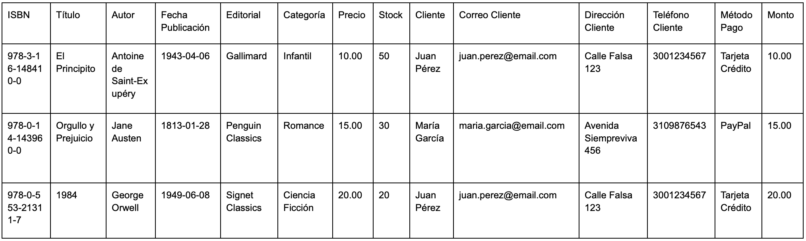

# bakend-Tienda-de-libros

Parte 1: Normalizacion
Tabla Original

1FN
la primera regla dice algo asi como que los atributos deben ser atomicos es decir que no se deben repetir o aver listas

2FN
la segunda dice algo asi como que aparte de que se deve estar cumpliendo la 1FN, todos los atributos deberian de depender de la llave con la que tengan relacion, y si no pues depender de alguna correspondiente si no forman parte de ninguna
por eso se hizo lo siguiente:

Libro:  ISBN(PK), Título, Autor, Fecha_Publicación, Editorial, Categoría, Precio, Stock
Cliente: Correo_Cliente(PK), Nombre_Cliente, Dirección_Cliente, Teléfono_Cliente
Pedido: ID_Pedido(PK), Correo_Cliente(PK), Método_Pago, Monto
Detalle_Pedido: ID_Pedido(FK), ISBN(FK), Cantidad, Precio_Unitario

3FN
la tercera dice algo asi como que aparte de que se deve estar cumpliendo la 2FN, que haya atributos que dependan de otros siendo ineportantes, o haya redundancias, no me hago entender paso a lo practico
en este caso por ejemplo si el autor editorial o categoría se repite, pues tenerlo como texto y ya seria poco practico entonces es mejor darle su propio espacio o tabla o nose como decirle
para clientes creo que mejor sera ponerle un id auto incremental a este punto y asi pues el cliente en algun futuro pues si quiere cambiar el correo no haya dependencia al pk y pues separo pedido de pago solo por practicidad

entoces la estructura final me queda algo asi:
Cliente: id_cliente, nombre, correo, direccion, telefono
Autor: id_autor, nombre_autor
Editorial: id_editorial, nombre_editorial
Categoria: id_categoria, nombre_categoria
Libro: isbn, titulo, fecha_publicacion, precio, stock, id_autor, id_editorial, id_categoria
Pedido: id_pedido, fecha_pedido, id_cliente
Detalle_Pedido id_pedido, isbn, cantidad, precio_unitario
Pago id_pago, metodo_pago, monto, fecha_pago, id_pedido
